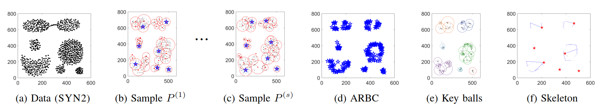
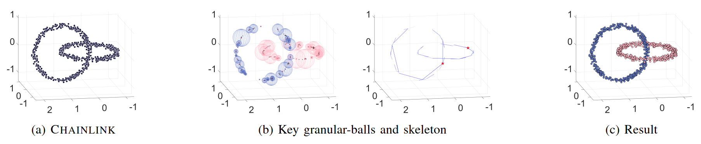

# GBSK: Skeleton Clustering via Granular-Ball Computing and Multi-Sampling for Large-Scale Complex Data
[Yewang Chen](https://faculty.hqu.edu.cn/CYW1), [Junfeng Li](https://github.com/MarveenLee), [Shuyin Xia](https://orcid.org/0000-0001-5993-9563), [Qinghong Lai](https://orcid.org/0009-0003-0712-9229), [Xinbo Gao](https://see.xidian.edu.cn/faculty/xbgao/), [Guoyin Wang](https://orcid.org/0000-0002-8521-5232), [Dongdong Cheng](https://orcid.org/0000-0003-3500-5461), [Yi Liu](https://orcid.org/0009-0008-9668-7076), [Yi Wang](https://orcid.org/0000-0002-9013-7232)

<!-- [[`Paper`]()] -->
[[`Demo`](https://github.com/XFastDataLab/GBSK?tab=readme-ov-file#-getting-started)] [[`Datasets`](https://github.com/XFastDataLab/GBSK?tab=readme-ov-file#-datasets)]
<!-- [[`BibTex`](#citing-GBSK)] -->

**Granular-ball Skeleton Clustering (GBSK)** is a scalable clustering algorithm designed for large-scale, complex data. By constructing multi-grained granular-balls from sampled data, it approximates the underlying structure of data as a compact "skeleton," reducing computation while maintaining accuracy. With linear time complexity (O(n)), GBSK handles massive datasets—up to 100M points in 256 dimension. The adaptive variant, AGBSK, simplifies parameter tuning for ease of use.




<!--
## 🔍 Overview
Traditional clustering methods often struggle with large and complex datasets due to computational constraints and sensitivity to noise. GBSK addresses these challenges by:

- Employing **granular-ball computing** to capture local data structures,
- Utilizing **multi-sampling** to enhance robustness and scalability,
- Constructing a **skeleton** that represents the core structure of the data, facilitating efficient clustering.
-->


<!--
## Updates
**2025/07/07 -- implementation as that used in the paper**
The code used in the paper is released.

-->

<!--
## 📁 Repository Structure

 `Algorithms/`: Contains the core implementation of the GBSK algorithm and competing algorithms.
 
 `Datasets/`: Some datasets for testing and demonstration purpose.
 
 `experiment_records/`: Logs and results from various experimental run.
 
 `README.md`: This documentation file.
 
 `LICENSE`: GPL-3.0 license information.
-->

## 🚀 Getting Started

### Prerequisites
GBSK is currently implemented in [MATLAB](https://www.mathworks.com/products/matlab.html). The code requires MATLAB version R2021a or later.

### Installation

1. Clone the repositoy:
   ```bash
   git clone https://github.com/XFastDataLab/GBSK.git
   ```

2. Add the `algorithms/` directory to your MATLAB path:
   ```matlab
   addpath(genpath('path_to_GBSK/algorithms'));
   ```

### Demo
Run `demo/demo1.m` or `demo/demo2.m`. Run `demo/ClusteringQualityEvaluation.py` to get evaluation results.

## ⚙️ Usage

1. Prepare your dataset in `.mat` or `.txt` format, ensuring it contains a variable representing an $N \times D$ matrix (N instances, D feature).

2. Place your dataset in the `datasets/` directoy.

3. Navigate to the `algorithms/` directory in MATLAB.

4. Run the main scrit: `main.m` for a dataset that does not exceed memory. Otherwise, edit and run `main_big.m`. 

5. Adjust parameters within the script as needed:
  - `s`: Number of sample sets (default: 30)
  - `$\alpha$`: Sampling proportion (default: $\frac{1}{\sqrt{n}}$ )
  - `k`: Number of desired clusters or root key balls representing cluster centers (a parameter must be inputted mannually)
  - `M`: Number of balls per sample set (default: $10 \times k$ )

## 📊 Output

Upon execution, results are stored in the `experiment_records/` directory, organized by dataset name and parameter settings. Each run includes:
- `labels.txt`: Cluster labels assigned to each data pont.
- `aggRepBallCenters.txt`: Centers of representative balls.
- `keyBallCenters.txt`: Centers of final key balls.
- `log.txt`: Detailed log of the run, including timing and parameter settigs.

## 📈 Performace

GBSK is designed for efficiency and scalabiity:

- **Time Complexity**: $O(n)$, significantly reduced compared to traditional clustering methods on large dataets.
- **Scalability**: Capable of handling datasets with millions of instances.
- **Robustness**: Effective in the presence of noise and outliers due to multi-sampling and density-based techniques.

## 📁 Datasets
GBSK has been tested on diverse synthetic and real-world datasets:

| Dataset       | Instances | Dims | Classes | Type | Size  | Usage | Label | Description |
|--------------|----------:|-----:|--------:|-----:|------:|------:|------:|-------------|
| [**Chainlink**](https://github.com/milaan9/Clustering-Datasets/blob/master/02.%20Synthetic/chainlink.csv)) | 1,000 | 3 | 2 | S | 20KB | Q | Y | Two interlocking 3D rings |
| [**Twenty**](https://github.com/milaan9/Clustering-Datasets/blob/master/02.%20Synthetic/twenty.mat) | 1,000 | 2 | 20 | S | 17KB | Q | Y | 20 evenly distributed clusters |
| **SYN1** | 2,000 | 2 | 5 | S | 30KB | Q | Y | Varying cluster densities |
| [**Segmentation**](https://doi.org/10.24432/C5P01G) | 2,310 | 18 | 7 | R | 246KB | Q | Y | Image segmentation data |
| **SYN3** | 3,000 | 2 | 2 | S | 4KB | Q | Y | Mixed density clusters |
| [**EngyTime**](https://github.com/milaan9/Clustering-Datasets/blob/master/02.%20Synthetic/engytime.arff) | 4,096 | 2 | 2 | S | 76KB | Q | Y | Gaussian distributions with overlap |
| [**Waveform**](https://doi.org/10.24432/C5CS3C) | 5,000 | 21 | 3 | R | 520KB | Q | Y | Physics waveform data |
| [**S3**](https://cs.joensuu.fi/sipu/datasets/s3.txt) | 5,000 | 2 | 15 | S | 136KB | Q | Y | 15 Gaussian clusters |
| **SYN2** | 5,800 | 2 | 7 | S | 7KB | Q | Y | Non-convex shapes |
| [**Pendigits**](https://doi.org/10.24432/C5MG6K) | 10,992 | 16 | 10 | R | 685KB | Q,S | Y | Handwritten digits |
| [**DryBean**](https://doi.org/10.24432/C50S4B) | 13,611 | 16 | 7 | R | 3.6MB | Q,S | Y | Bean classification |
| [**CIFAR-10**](https://api.semanticscholar.org/CorpusID:18268744) | 60,000 | 3,072 | 10 | R | 174MB | Q,S | Y | Image classification |
| [**MNIST**](https://www.csie.ntu.edu.tw/~cjlin/libsvmtools/datasets/multiclass.html#mnist) | 70,000 | 784 | 10 | R | 121MB | Q,S | Y | Handwritten digits |
| [**MoCap**](https://doi.org/10.24432/C5960R) | 78,095 | 36 | 5 | R | 43MB | Q,S | Y | Motion capture data |
| [**CoverType**](https://doi.org/10.24432/C50K5N) | 581K | 54 | 7 | R | 71MB | Q,S | Y | Forest cover types |
| **3M2D5** | 3M | 2 | 5 | S | 54MB | Q,S | Y | Large Gaussian mixtures |
| [**N-BaIoT**](https://www.kaggle.com/datasets/mkashifn/nbaiot-dataset) | 7M | 115 | 9 | R | 7.6GB | S | N | IoT malware traffic |
| [**MNIST8M**](https://www.csie.ntu.edu.tw/~cjlin/libsvmtools/datasets/multiclass.html#mnist8m) | 8.1M | 784 | 10 | R | 5.9GB | Q,S | Y | Augmented MNIST |
| [**AGC100M**](https://www.kaggle.com/datasets/caatic7/agc100m) | 100M | 256 | 17 | S | 95GB | Q,S | Y | Ultra-large-scale benchmark |

- **Type**: S = Synthetic, R = Real-world  
- **Usage**: Q = Quality evaluation, S = Speed testing  
- **Label**: Y = Labeled, N = Unlabeled  

## 📄 Licnse

This project is licensed under the [GNU General Public License v3.0](https://www.gnu.org/licenses/gpl-3.0.en.tml).

## 🤝 Acknowledgents

Developed and maintained by [XFastDataLab](https://github.com/XFastDataLab). For questions or collaborations, please contact [MarveenLee](mailto:G2219100349@gmail.com).

## 🙏 Citing GBSK
Cite our work if you use GBSK or the AGC100M dataset!
<!--
If you use GBSK or the AGC100M dataset in your research, please use the following BibTeX entry.
```bibtex
@article{chen2025GBSK,
  title={GBSK: Skeleton Clustering via Granular-Ball Computing and Multi-Sampling for Large-Scale Complex Data},
  author={Yewang Chen and Junfeng Li and Shuyin Xia and Qinghong Lai and Xinbo Gao and Guoyin Wang and Dongdong Cheng and Yi Liu and Yi Wang},
  journal={arXiv preprint arXiv:},
  url={https://arxiv.org/abs/},
  year={2025}
}
```
-->
---

For more information and updates, visit the [GBSK GitHub repository](https://github.com/XFastDataLab/GBSK/treemain).

--- 
